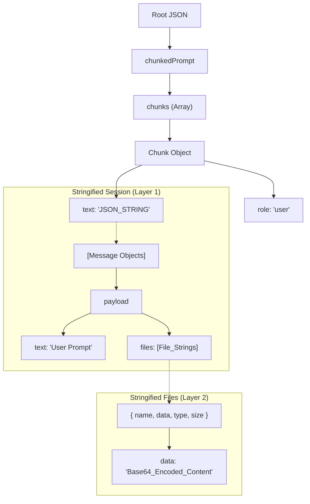

# Google AI Studio Export Format & Bundler Guide

This document explains the technical structure of the `.json` files exported by Google AI Studio and providing instructions for using the `bundle_to_ai_studio.py` tool.

---

## 1. AI Studio JSON Structure (Detailed)

The AI Studio export format is unique because it uses **"Double Stringification"**. Instead of a standard nested JSON object, it stores complex data (like messages and files) as escaped JSON strings inside other strings.

### The Hierarchy:

1.  **Outer Layer**: The root object.
    *   `chunkedPrompt`: Contains the session data.
    *   `chunks`: An array of session turns (usually just one "user" turn for exports).

2.  **Turn Layer** (The first stringification):
    *   `role`: "user" or "model".
    *   **`text`**: This is a **STRING**, not an object. It contains a stringified JSON array of all messages in the conversation.

3.  **Message Layer**:
    *   Inside the stringified `text`, you find an array of message objects.
    *   `payload`: Contains the `text` (prompt) and a `files` array.

4.  **File Layer** (The second stringification):
    *   **`files`**: This is an array of **STRINGS**. Each string is itself a stringified JSON object representing a single file.
    *   Inside each stringified file object:
        *   `name`: The filename/path.
        *   `data`: The file content encoded in **Base64**.
        *   `type`: Mime-type (e.g., `text/plain`).

### Visual Map:


---

## 2. Using the Universal Bundler

The provided `bundle_to_ai_studio.py` script replicates this exact structure automatically.

### Installation
No installation is required other than having Python 3 installed. The script uses standard libraries.

### Command Guide
Specify the folder you want to bundle. If no folder is specified, it bundles the current directory.

```bash
# Bundle the current folder
python3 bundle_to_ai_studio.py

# Bundle a specific project folder
python3 bundle_to_ai_studio.py /path/to/my_project
```

### Script Features
- **Auto-Ignore**: Skips folders like `.git`, `node_modules`, `venv`, and `__pycache__` to keep the bundle small.
- **Binary Detection**: Automatically checks if a file is text or binary to set the correct metadata.
- **Base64 Encoding**: Properly encodes all source code so that it can be transmitted safely in JSON.
- **Universal**: Works for any programming language or repository type.

---

## 3. Why Use This Format?
While the AI Studio UI has a "Upload Folder" button, this JSON format is necessary if you are:
1.  **System Integration**: Automating the creation of AI project contexts.
2.  **Backups**: Storing a "snapshot" of a conversation state that includes code.
3.  **Re-importing**: This specific format can be imported back into AI Studio to restore a session turn exactly as it was.
