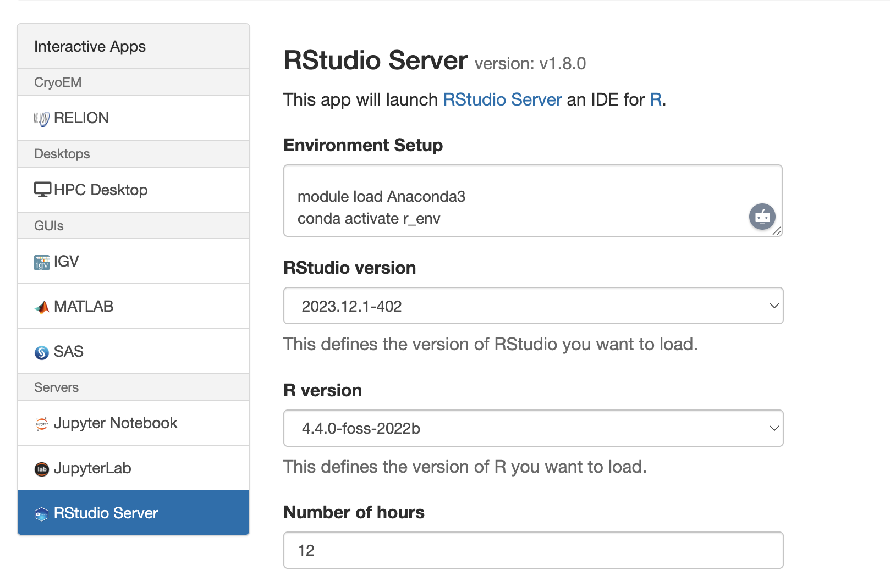

# Running Seurat on Cheaha: CRAN First, Conda Only If Necessary

## Read This First

1. **Always start by running interactive RStudio on Cheaha** and try installing R packages **directly from CRAN / Bioconductor**.
2. If that fails (common for Seurat on Cheaha), **fall back to Conda (conda-forge)**.
3. Conda is a **workaround**, not the ideal long-term R solution.

---

## Step 0 — Start RStudio Interactively on Cheaha

Use **Open OnDemand → Interactive Apps → RStudio**.

Do **not** activate Conda yet. Let Cheaha provide its default R.

Once RStudio is open, confirm:

```r
R.version.string
```

---

## Step 1 — Try the Correct Way First (CRAN)

Seurat **is available on CRAN for all platforms**.

Inside RStudio:

```r
install.packages("Seurat")
library(Seurat)
```

If this works, **stop here**. This is the best outcome.

Why this is preferred:

* Native R toolchain
* Clean interaction with Bioconductor
* No Conda interference
* Works best with `renv` for reproducibility

---

## Step 2 — If CRAN Fails (Very Common on Cheaha)

Typical failure reasons:

* Missing system libraries (HDF5, FFTW, curl, ICU)
* Compilation failures for C++ dependencies
* ABI mismatch on Cheaha nodes

At this point, **do not keep fighting CRAN**.

Move to Conda.

---

## Step 3 — Conda-forge Approach (Stable Fallback)

### 1. Create a Conda environment with Seurat (in terminal)

```bash
module load Anaconda3
conda create -n r_env -c conda-forge \
  r-base \
  r-essentials \
  r-seurat
```

Why conda-forge:

* Ships precompiled R binaries
* Resolves system dependencies correctly
* `r-seurat` installs without compilation

---

### 2. Activate the environment (OOD Environment Setup window)

In **Open OnDemand → RStudio → Environment Setup**:

```bash
module load Anaconda3
conda activate r_env
```



*Paste these commands into the Open OnDemand Environment Setup window before launching RStudio.*

Then launch the job.

---

### 3. Verify inside RStudio

```r
Sys.which("R")
.libPaths()
packageVersion("Seurat")
```

All paths must point to `.conda/envs/r_env`.

If not, your setup is wrong.

---

## Important Warning About Conda + R on Cheaha

Using Conda for R **will eventually bite you**, especially with:

* **Bioconductor packages**
* Packages with compiled code
* Mixed CRAN + Bioc dependency graphs

Common issues:

* Version lag in conda-forge
* Bioconductor release mismatch
* Silent runtime errors

Conda is **acceptable as a temporary workaround**, not a permanent R ecosystem.

---

## Best Practice (Strongly Recommended)

If CRAN works:

* Use **system RStudio**
* Install from **CRAN + Bioconductor**
* Lock versions with **`renv`**

Example:

```r
install.packages("renv")
renv::init()
```

This is the cleanest and most future-proof workflow.

---

## Decision Rule (Memorize This)

* CRAN works → **use it**
* CRAN fails → **Conda-forge temporarily**
* Long-term project → **CRAN + Bioconductor + renv**

Anything else is technical debt.

---
